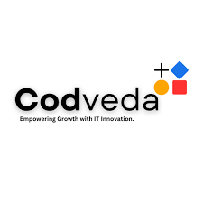

# Codveda Machine Learning Internship

  

 

  

## 📌 Overview
This repository contains the completed projects and tasks for the **Machine Learning Internship at Codveda Technology**. The internship program focuses on developing practical machine learning skills across multiple levels of complexity, from foundational data preprocessing to advanced deep learning architectures.

As per the internship guidelines, three tasks were selected and completed for each of the three difficulty levels, resulting in 9 distinct machine learning projects.

## 📂 Repository Structure & Task Mapping

The repository is organized into 9 folders, each containing the Jupyter Notebook (`Notebook.ipynb`) for the respective task:

**Branch Naming Convention:**
* `Task1:` [**Data Preprocessing**](https://github.com/Youssef3082004/Codveda_Internship/tree/root/Task1/Notebook.ipynb)
* `Task2:` [**Linear Regression Model**](https://github.com/Youssef3082004/Codveda_Internship/tree/root/Task2/Notebook.ipynb)
* `Task3:` [**K-Nearest Neighbors Classifier**](https://github.com/Youssef3082004/Codveda_Internship/tree/root/Task3/Notebook.ipynb)
* `Task4:` [**Logistic Regression**](https://github.com/Youssef3082004/Codveda_Internship/tree/root/Task4/Notebook.ipynb)
* `Task5:` [**Decision Tree**](https://github.com/Youssef3082004/Codveda_Internship/tree/root/Task5/Notebook.ipynb)
* `Task6:` [**K-Means**](https://github.com/Youssef3082004/Codveda_Internship/tree/root/Task6/Notebook.ipynb)
* `Task7:` [**Random Forest Classifier**](https://github.com/Youssef3082004/Codveda_Internship/tree/root/Task7/Notebook.ipynb)
* `Task8:`  [**Support Vector Machine**](https://github.com/Youssef3082004/Codveda_Internship/tree/root/Task8/Notebook.ipynb)
* `Task9:`  [**Neural Networks**](https://github.com/Youssef3082004/Codveda_Internship/tree/root/Task9/Notebook.ipynb)

---
<h3 align="center">Built for the Codveda Technology Machine Learning Internship Program</h3>